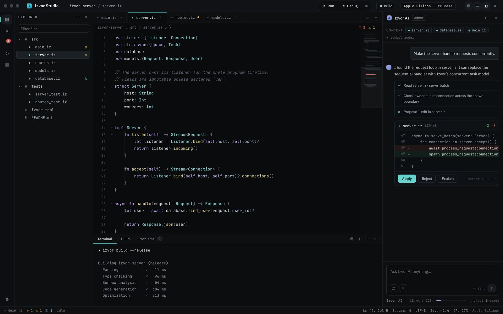
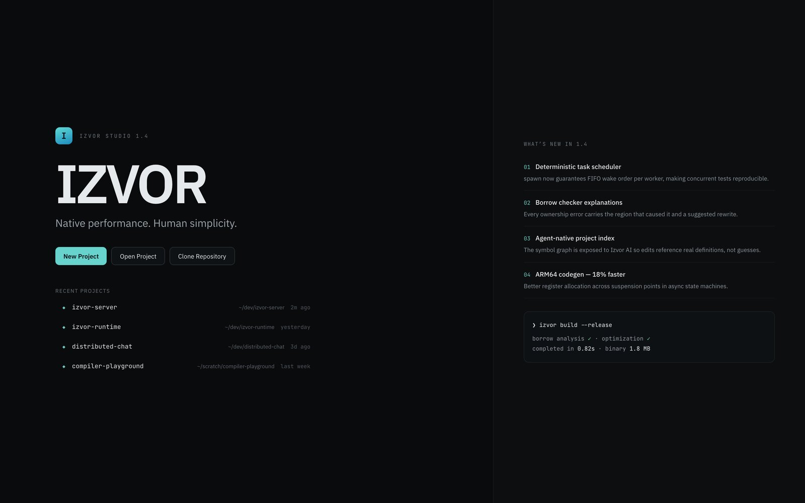
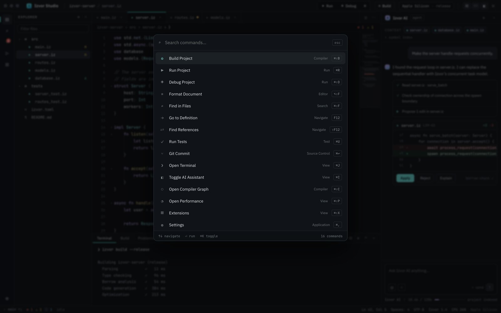
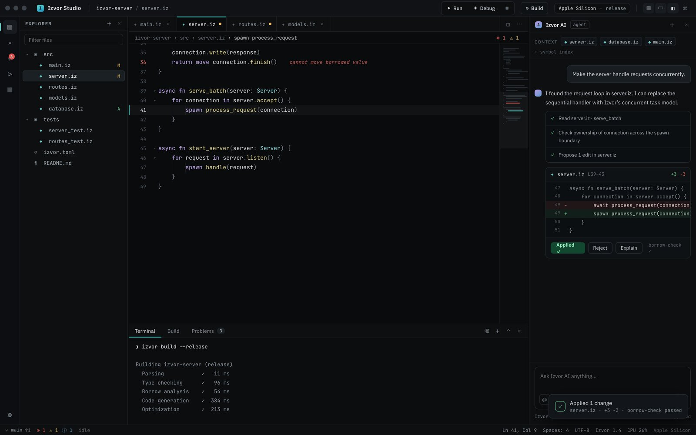
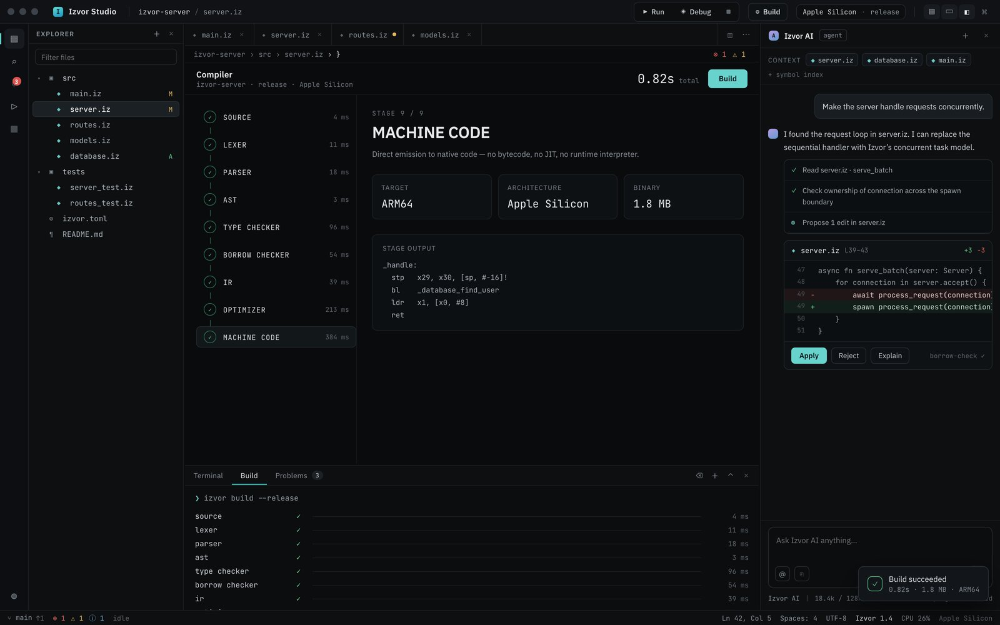
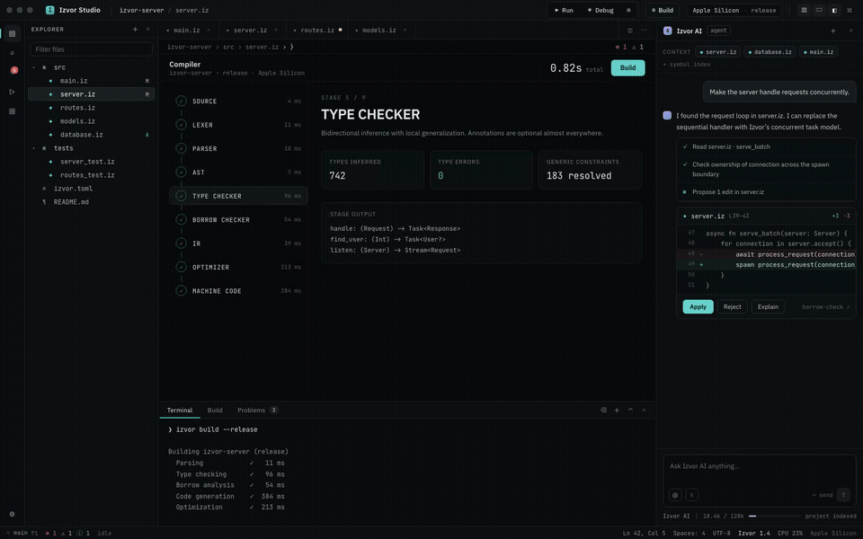
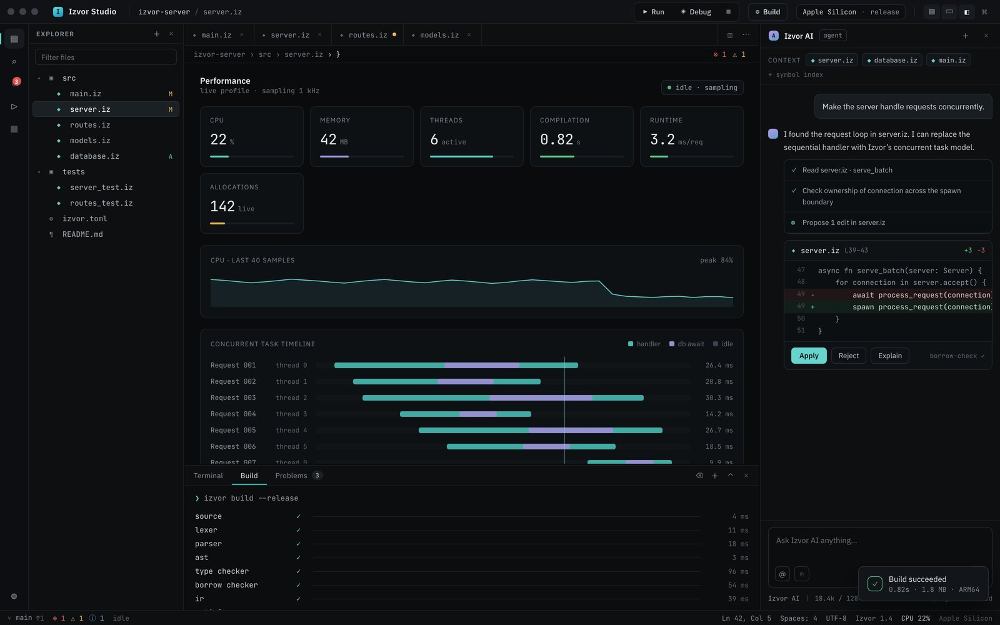
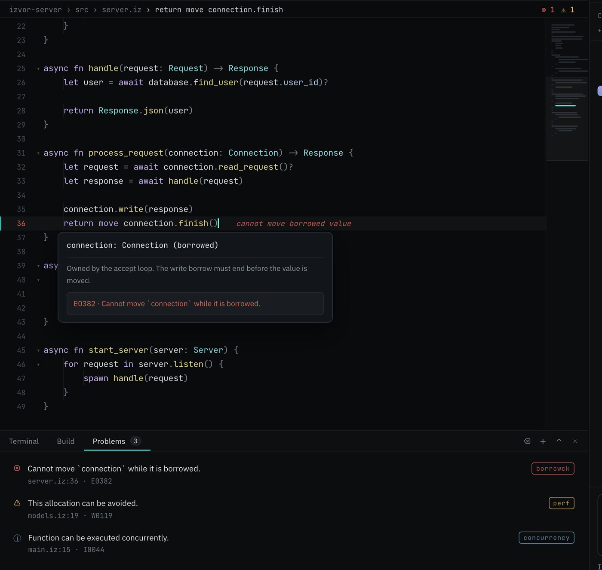
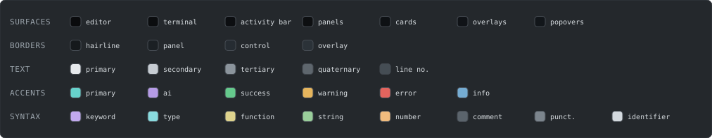

# Izvor Studio

Izvor Studio is a high-fidelity, interactive prototype of the IDE for
[izvor](https://github.com/levimackay/izvor), a programming language I am
writing in C. It was designed with Claude Design. Open `Izvor Studio.dc.html`
directly in a browser to try it (it needs `support.js` sitting next to it,
nothing else, no build step).

> **Read this first.** Everything on screen here is a design target, not a
> report of what exists. The code, the metrics, the compiler stages, all of
> it is fixture data written to show where I want the tooling to go. The real
> compiler today handles `Int` and `Bool`, functions, `if` and `while`, and
> compiles down to C and then a native binary. Nothing in this prototype is
> claimed as built. Details on the gap are in the sections below.

## The screens

### Welcome

The landing screen. Wordmark, recent projects, and a changelog panel for
the version the prototype pretends to be on. Clicking a recent project opens
the workspace.

<table>
<tr>
<td width="50%">

**Command palette.** `Cmd/Ctrl+K` opens it. Every command in the list runs
something real in the prototype's own state, build, run, toggle a panel,
jump to a symbol.

</td>
<td width="50%">

**Izvor AI applying a change.** This is not a screenshot of a static mock.
Clicking Apply here actually rewrites the line in `server.iz`, marks the
file dirty, and jumps the editor to it.

</td>
</tr>
</table>

### Compiler view

This is the screen I care most about. Nine stages, source through machine
code, each one showing the kind of output a real compiler pass would
produce: token counts, the resolved AST, inferred types, the region solve
for borrow checking, SSA blocks, and finally ARM64 assembly. The stage list
and the metrics are invented, but the shape of what a compiler dashboard
should tell you is the point.

The build animates stage by stage rather than jumping straight to done.

### Performance view

CPU, memory, thread count, and a per-request concurrency timeline, styled
like a profiler you would actually want to leave open while a service runs.

### Inline diagnostics and hover cards

Hovering a diagnosed line surfaces the type, the borrow state, and the error
code together. The borrow checker error shown here (`E0382`) is one of
three fixture diagnostics wired into the demo project.

## The design system

Dark first, color used sparingly. Hierarchy comes from typography, spacing,
and 1px borders rather than from decoration.

Type is **IBM Plex Sans** for UI (11 to 13.5px body, 20 to 26px headings)
and **JetBrains Mono** for code, paths, and every number on screen (10.5 to
13px). Uppercase section labels sit at 10.5px with 0.09 to 0.11em tracking.

Motion is 0.1 to 0.24s on `cubic-bezier(0.16, 1, 0.3, 1)`, nothing longer
than 0.25s except the compiler's stage cadence, which is a deliberate 230ms
per stage so the build reads as a sequence instead of a jump cut.

Full token reference

Surfaces (darkest to lightest): `#0a0b0d` editor canvas, `#0b0d0f` terminal,
`#0c0e11` activity bar, `#0d0f11` panels and chrome, `#0e1114` cards,
`#101317` overlays, `#12161a` popovers.

Borders: `#15191c` hairline, `#1b2024` panel, `#262c32` control, `#2b3238`
overlay.

Text: `#e6e9ec` primary, `#c6ccd2` secondary, `#8b949c` tertiary, `#5e666d`
quaternary, `#454d54` line numbers.

Accents: primary `oklch(0.80 0.10 190)` (cyan, active states, primary
buttons, cursor), AI `oklch(0.74 0.11 300)` (violet), success
`oklch(0.76 0.13 155)`, warning `oklch(0.80 0.12 80)`, error
`oklch(0.66 0.16 25)`, info `oklch(0.72 0.08 240)`.

Syntax: keyword `oklch(0.78 0.10 300)`, type `oklch(0.84 0.08 200)`,
function `oklch(0.86 0.09 100)`, string `oklch(0.80 0.09 145)`, number
`oklch(0.83 0.10 70)`, comment `#5b646c` italic, punctuation `#7c858d`,
identifier `#d3d9de`.

Metrics: row height 22px (code), 25px (tree), 26 to 30px (buttons); radii 4,
5, 6, 7, 9, 12px from small chrome up to overlays; activity bar 46px; status
bar 24px; tab strip 35px.

Every screen and feature in the prototype

- **Welcome screen**: wordmark, "Native performance. Human simplicity.",
  New/Open/Clone, recent projects, "What's new in 1.4" panel.
- **New Project**: 7 templates, project name/location, target (Apple
  Silicon, x86_64, ARM64 Linux, WebAssembly), language version, live
  scaffold preview.
- **Main workspace**: activity bar (Explorer, Search, Source Control, Run &
  Debug, Extensions) with tooltips; file explorer with expand/collapse,
  filter, git badges, right-click context menu; editor tabs with dirty
  indicator and close buttons; breadcrumbs with diagnostic counts; status
  bar.
- **Code editor**: hand-written tokenizer for Izvor syntax highlighting,
  line numbers, current-line highlight, indentation guides, code folding,
  minimap with viewport and error marks, inline diagnostics, hover type/doc
  cards, autocomplete popup (Ctrl+Space), blinking cursor.
- **Izvor AI** (right panel): context chips, agent plan checklist,
  streaming responses, a unified diff with Apply / Reject / Explain. Apply
  actually mutates the source (`await process_request` becomes
  `spawn process_request`), marks the file dirty, and navigates to the
  changed line. Context meter, model row, attachment buttons.
- **Terminal** (bottom panel): Terminal / Build / Problems tabs, realistic
  `izvor build` and `izvor run` output appended live, clear / new / maximize
  / close controls.
- **Compiler view**: the 9-stage pipeline (SOURCE, LEXER, PARSER, AST, TYPE
  CHECKER, BORROW CHECKER, IR, OPTIMIZER, MACHINE CODE). Build animates
  stages sequentially; each stage shows real-looking metrics, a blurb, and
  representative stage output (tokens, AST dump, inferred signatures,
  region solve, SSA blocks, ARM64 asm).
- **Performance view**: 6 metric cards, live CPU sparkline, concurrent task
  timeline with handler/await segmentation per thread, playhead.
- **Problems panel**: 3 diagnostics (borrow error, avoidable allocation,
  concurrency hint); clicking navigates to the exact file and line.
- **Run & Debug**: Run/Debug/Stop, session state, breakpoints, call stack,
  variables, watch, threads; stack frames navigate to source.
- **Command palette**: Cmd/Ctrl+K, 16 commands with groups and shortcuts,
  arrow-key navigation, all commands functional.
- **Global search**, **Source Control** (branch, commit box, changes with
  stats), **Settings** (9 categories, working toggles/steppers/segmented
  controls), **Extensions** marketplace with working install buttons.
- Resizable explorer / AI / terminal panels; toast notifications; keyboard
  shortcuts (Cmd+K palette, Cmd+B explorer, Cmd+J terminal, Cmd+I AI, Cmd+R
  run, Cmd+Shift+B build, Esc dismiss).

The language this represents

These are design goals, not implemented features. The prototype's sample
code is written against them so the tooling has something worth showing.

- Native performance, compiles directly to machine code, no bytecode, no JIT
- Static typing with strong inference, annotations optional almost everywhere
- Memory safety without manual memory management (region/borrow inference,
  no GC)
- First-class concurrency (`spawn`, `await`, task scheduler, async lowered
  to state machines)
- Simple readable syntax, legible to humans and coding agents alike
- Excellent tooling as a first-class concern

Syntax conventions in the sample code: `fn`, `async fn`, `struct`, `impl`,
`use module.{A, B}`, `let` (immutable) / `var` (mutable), `?` for
error/optional propagation, `spawn expr` to move a task onto the scheduler,
`move` for explicit ownership transfer, `Task<T>`, `Stream<T>`, `Handle<T>`,
4-space indentation, no semicolons. The real language ended up requiring
semicolons. Project manifest is `izvor.toml`. CLI is `izvor build --release`,
`izvor run`, `izvor test`, `izvor fmt`, `izvor debug`.

The demo project inside the prototype is `izvor-server`, a concurrent HTTP
service: `src/main.iz server.iz routes.iz models.iz database.iz`, tests for
`server` and `routes`, and an `izvor.toml`. Full source for every file is
inlined in the logic class and is deliberately consistent across files,
imports resolve, symbols cross-reference, diagnostics point at real lines.

Notes for implementing this for real

Treat this file as the spec, not the codebase.

1. Keep the design system above verbatim, colors, type, spacing, motion
   timings.
2. Keep the information architecture: activity bar to panel to editor to
   AI, terminal at the bottom, compiler and performance as full-canvas
   views rather than panels.
3. The compiler view is the product's signature screen. Its stage list
   should be driven by real compiler telemetry, per-stage timings,
   token/node/type/region counts, target info.
4. Replace fixtures with real sources: LSP for diagnostics, hovers,
   completion, definitions; the real `izvor` CLI for build/run/test output;
   a profiler feed for the performance view.
5. Diagnostics in the prototype are a borrow error, an avoidable
   allocation, and a concurrency hint. These three categories are
   intentional and should stay first-class in the real diagnostics UI.
6. Fonts are the only external dependency. Everything else is
   self-contained.

Open questions: the final `.iz` grammar and keyword set, whether `move`
stays explicit, the exact compiler stage names worth exposing in the UI,
and whether the assistant panel is backed by a local or a hosted model. The
language's own roadmap is in the compiler repo's
[ROADMAP.md](https://github.com/levimackay/izvor/blob/main/docs/ROADMAP.md).

## Files

- `Izvor Studio.dc.html`: the whole prototype. Head/body scaffold, then the
  markup template, then a `class Component` logic class holding all state,
  fixture data, and computed render values. Styling is inline throughout
  (only `@keyframes`, fonts, and body resets live in a stylesheet block).
- `support.js`: the small runtime that renders the template. Required,
  keep it next to the HTML file.

## Compiler and license

The real compiler this prototype is designed for lives at
[github.com/levimackay/izvor](https://github.com/levimackay/izvor).

MIT licensed, see [LICENSE](LICENSE).
